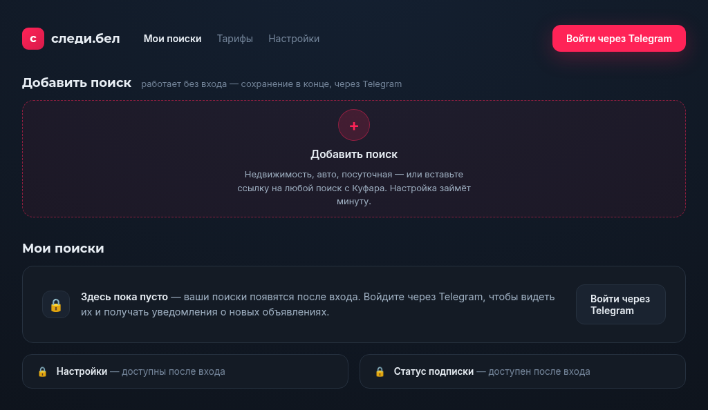
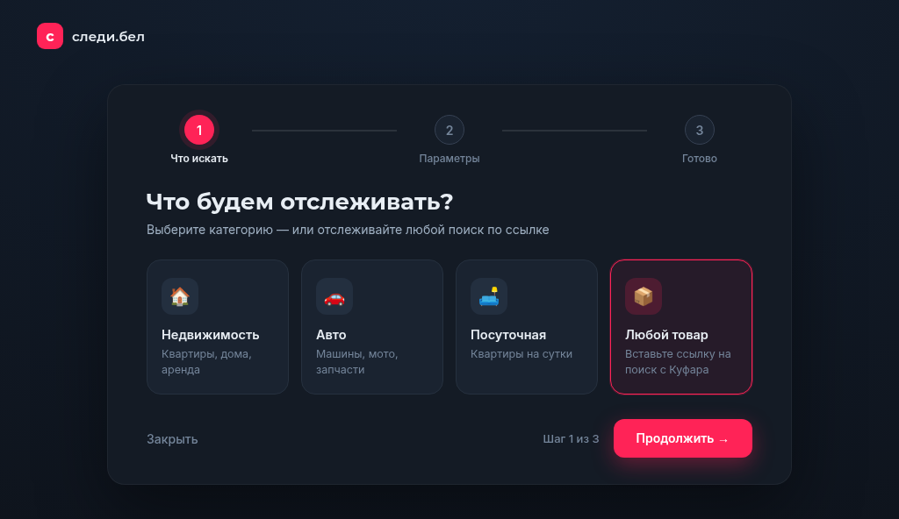
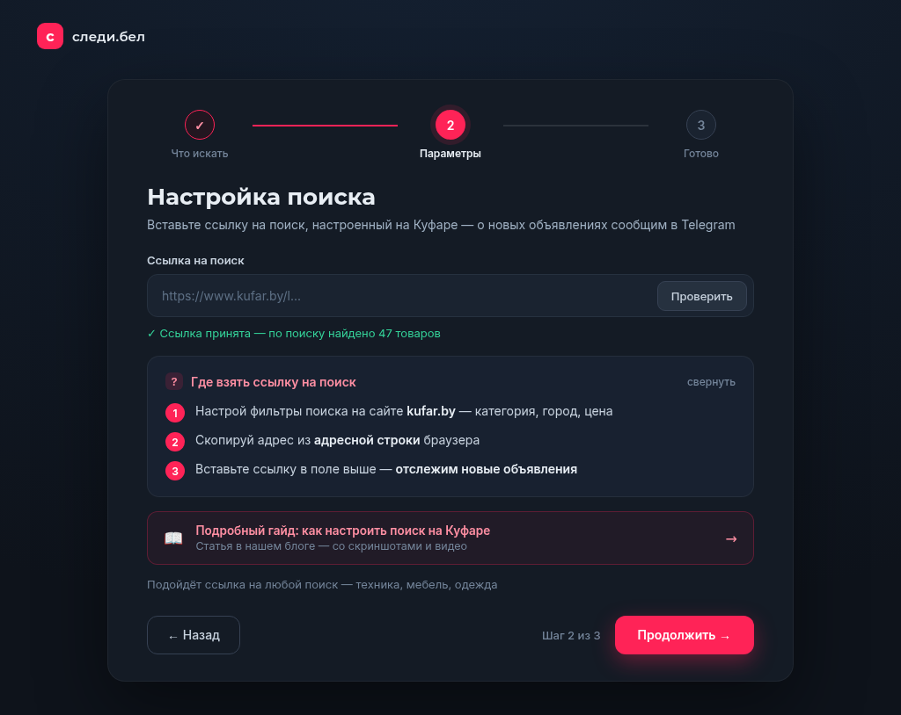
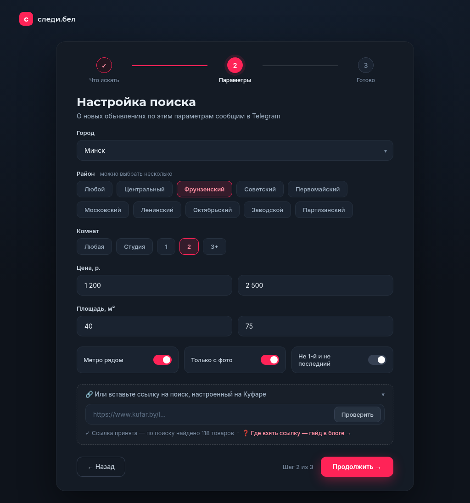
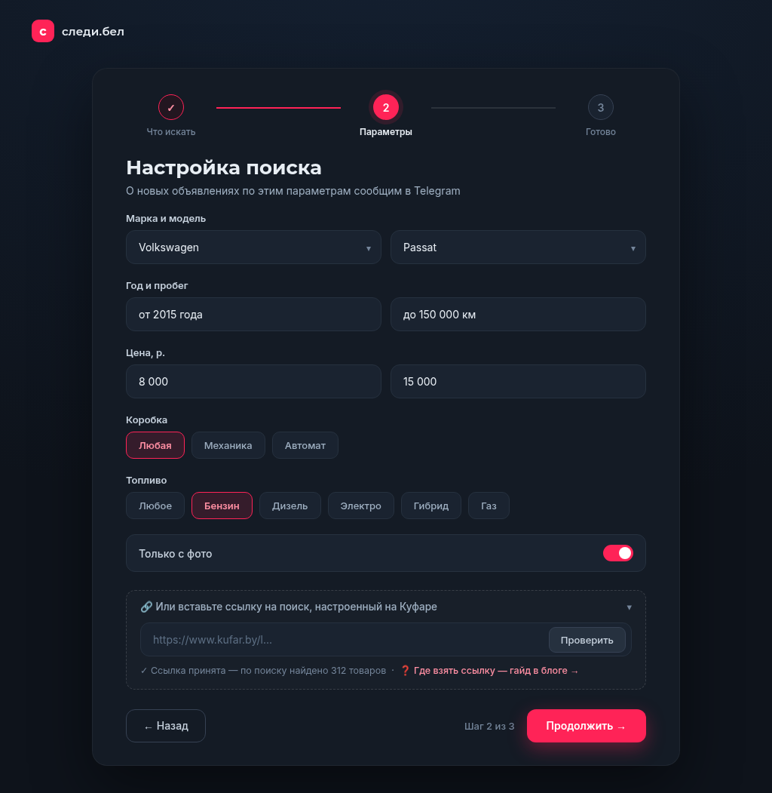
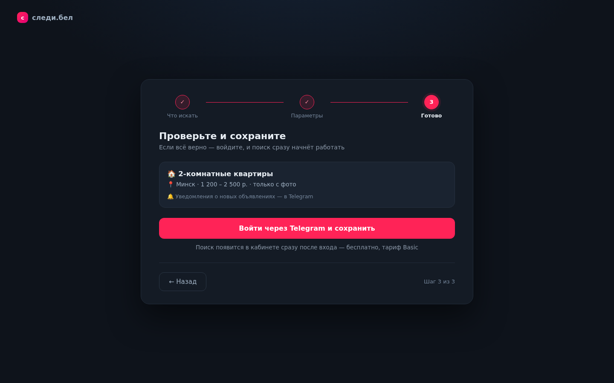
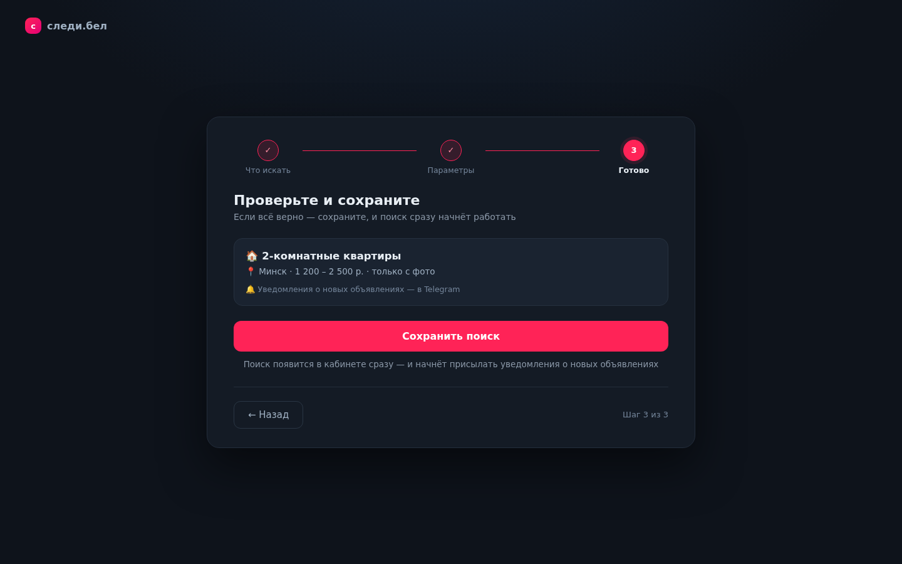
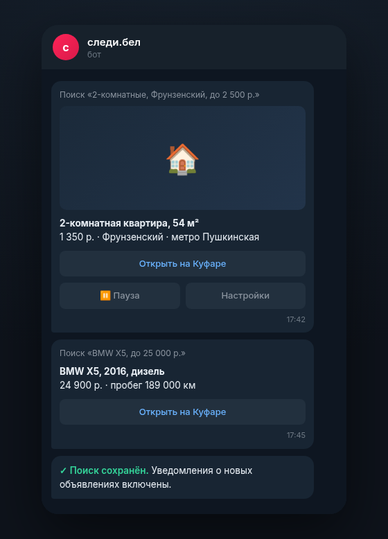
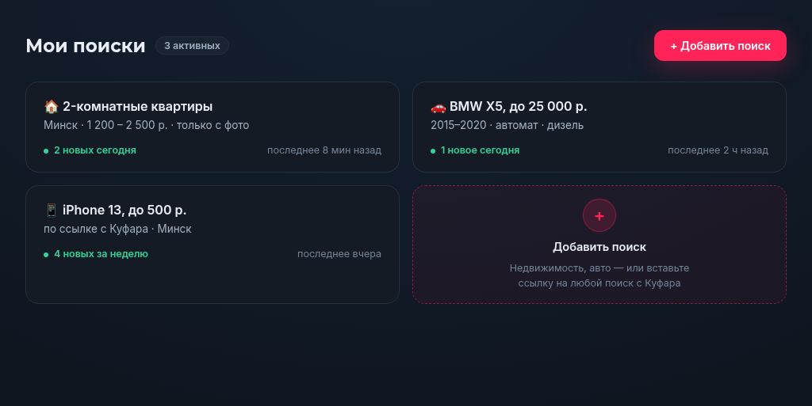
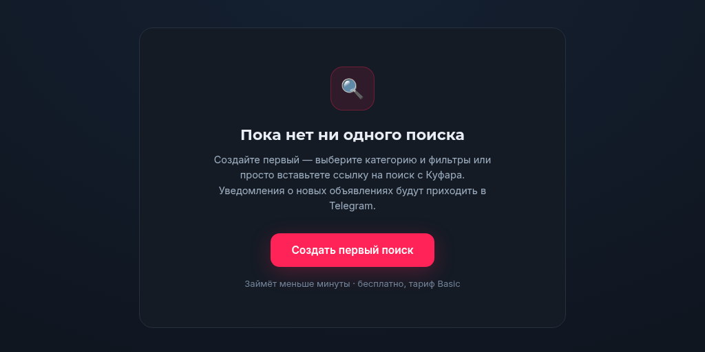

# Следи.бел — уведомления о новых объявлениях на Куфаре в Telegram

Нужная вещь на Куфаре уходит за минуты: хорошая квартира, свежий BMW или дешёвый iPhone появляются и исчезают быстрее, чем вы успеваете обновлять страницу. **следи.бел** следит за вашими поисками 24/7 и присылает уведомление в Telegram, как только на Куфаре появляется новое объявление по вашим критериям — в течение минут после публикации.

- Сайт: **[следи.бел](https://следи.бел)**
- Telegram-бот: **[@kufarbelbot](https://t.me/kufarbelbot)**
- Канал с новостями: **[@KufarInfo](https://t.me/KufarInfo)**

## Зачем это нужно

Вручную обновлять поиск бесполезно: хорошие объявления уходят часами, а то и минутами. следи.бел — это бот для Куфара, который следит за объявлениями вместо вас: проверяет поиски автоматически, и вам остаётся только получить уведомление и успеть первым.

## Что умеет следи.бел

- **Отслеживание новых объявлений** по любым критериям — город, район, цена, параметры;
- **Конструктор недвижимости** — квартиры и дома: комнаты, район, метро рядом, площадь, этаж, «только с фото»;
- **Конструктор авто** — марка и модель, год, пробег, цена, коробка передач, топливо;
- **Посуточная аренда** — квартиры на сутки по городам;
- **Любой товар по ссылке** — вставьте ссылку на поиск, настроенный на Куфаре, и работают все фильтры Куфара без исключений;
- **Уведомления в Telegram** — фото, цена, параметры и кнопка «Открыть на Куфаре»;
- **Веб-кабинет** — все поиски, счётчики новых объявлений и последние находки в одном месте;
- **Пауза поиска** в один клик, если уехал или передумал.

## Какие объявления можно отслеживать

Практически любые на [kufar.by](https://www.kufar.by):

| Категория | Примеры поисков |
|---|---|
| Недвижимость | 2-комнатные квартиры до 2 500 р. во Фрунзенском районе, дома под снос, аренда без посредников |
| Авто | BMW X5 до 25 000 р., дизель, автомат; запчасти по марке |
| Посуточная | квартиры на сутки в Минске и областных городах |
| Любые товары | iPhone 13 до 500 р., велосипед, инструменты, мебель — всё, что есть на Куфаре |

Способ «по ссылке» покрывает всё: настроили на Куфаре любые фильтры (в том числе редкие) — скопировали адрес из браузера — вставили в следи.бел. Всё, что появилось по этому поиску, придёт уведомлением.

## Как настроить отслеживание — 2 минуты

1. Откройте [следи.бел](https://следи.бел) и нажмите **«Создать поиск»** (вход не нужен — он понадобится только в самом конце);
2. Выберите категорию — или «Любой товар», если хотите отслеживать **по ссылке с Куфара**;
3. Задайте фильтры (для недвижимости и авто — удобные конструкторы);
4. Для ссылки: настройте фильтры на kufar.by, скопируйте адрес из адресной строки, вставьте в поле и нажмите **«Проверить»** — увидите «Ссылка принята — по поиску найдено N товаров»;
5. Нажмите **«Войти через Telegram и сохранить»** — всё, уведомления включены.

Подробный гайд со скриншотами: «[Как настроить поиск на Куфаре](https://следи.бел/guides/kak-nastroit-poisk-na-kufare)».

## Как приходят уведомления

Как только на Куфаре появляется объявление под ваш поиск, в Telegram приходит сообщение с фото, ценой и параметрами и кнопкой **«Открыть на Куфаре»**. Никаких пропусков: мы следим за поиском непрерывно, а не раз в час.

## Веб-кабинет

В кабинете — все ваши поиски с счётчиками новых объявлений, время последней находки, тарифы и настройки. Работает и без входа: добавить поиск можно сразу, а вход через Telegram нужен, чтобы сохранить поиск и получать уведомления.

## Тарифы

| Тариф | Цена | Что входит |
|---|---|---|
| **Basic** | бесплатно | 1 поиск, уведомления с задержкой до 15 минут |
| **Pro** | 7.90 р./мес или 130 ⭐ | больше поисков, уведомления без задержки |
| **Max** | 14.90 р./мес или 250 ⭐ | максимум поисков и приоритетная доставка |

Оплата: **ЕРИП** (картой) в личном кабинете или **Telegram Stars** прямо в боте. Подписка действует 30 дней; по окончании аккаунт автоматически возвращается на бесплатный Basic — поиски не удаляются.

> Цены и лимиты уточняются — сверить с итоговым реестром тарифов (волна K-308) перед публикацией.

## Частые вопросы

**Это бесплатно?**
Да, тариф Basic бесплатен: один поиск и уведомления с небольшой задержкой. Платные тарифы ускоряют доставку и снимают лимиты.

**Нужна ли регистрация?**
Нет. Сайт работает без регистрации; вход через Telegram нужен один раз — чтобы сохранить поиск и получать уведомления.

**Успею ли я, если объявление появилось, пока я был офлайн?**
Да: уведомления копятся, ничего не теряется.

**Можно ли отслеживать не товар, а весь поиск с моими фильтрами?**
Да, это основной сценарий: настроенный на Куфаре поиск передаётся ссылкой, и мы следим за всеми новыми объявлениями в нём.

**Можно ли поставить поиск на паузу?**
Да, в один клик — в боте или в кабинете.

---

## Ссылки

- Сайт: [следи.бел](https://следи.бел)
- Бот: [@kufarbelbot](https://t.me/kufarbelbot)
- Канал: [@KufarInfo](https://t.me/KufarInfo)
